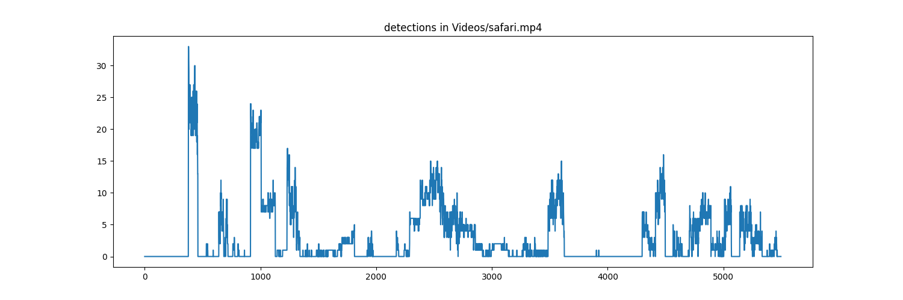
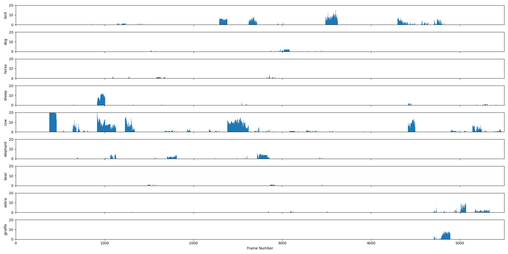

# SafariCount : utilisation de Yolo dans la détection d'animaux. 

Ce repo a pour but d'utiliser Yolo dans la détection des animaux de la savane et d'observer ses performances. 

# Première étape : évaluation du modèle. 

Le module `createDatas.py` utilise Yolo pour remplir un dossier `Datas` de fichiers texte contenant les rectangles de détection de chaque animal, avec le seuil de confiance, si il y a eu détection. 

Le module `analyseDatas.py` évalue le nombre de détection dans tout le film. 

Il existe donc des séquences où il n'y a pas d'animaux détectés et d'autres où il y a des détections. 

Ces séquences sans animaux sont stockées dans un fichier qui servira par la suite. 

On peux ensuite évaluer les détections pour chaque animal. 

## premières conclusions. 

On constate que certains animaux ne sont pas détectés. 

Il existe aussi des confusions : des animaux sont confondus avec d'autres animaux. 

# Deuxième étape : ré-entrainement du modèle. 

Pour corriger ces problématiques, on va utiliser le modèle Segment Anything Model ou SAM. 

Ce modèle va trouver les contours de tous les objets présents dans une image. 

Il est inutile d'appliquer SAM à toutes les images car le temps de calcul sur une image est relativement long, environ 30 secondes sur un Mac M1. 

On l'applique alors sur certaines images où il y a eu détection avec un score suffisament grand et sur des images où il n'y a pas eu de détections. 

Les images où il n'y a pas d'animaux représentent les objets négatifs c'est-à-dire les objets non animal. 

