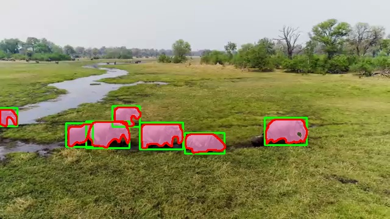

# SafaryCount

L'objectif de ce dépôt est d'améliorer les détections d'éléphants faites par YOLO.

En visualisant ces détections, on s'aperçoit qu'elles ne sont pas parfaites : dans certaines images, des éléphants manquent ou sont confondus avec d'autres animaux (vaches ou oiseaux). C'est pour cela que les rectangles détectés changent de couleur car l'identifiant de classe change. 

L'identifiant de la classe pour cet animal porte le numéro 20.

Afin d'améliorer les prédictions, on peut réentraîner YOLO en créant un nouveau modèle spécifique aux éléphants. Ce modèle ne reconnaîtra qu'une seule catégorie d'objets : les éléphants, il aura donc une seule classe.

Pour cela, il faut récolter les Regions Of Interest, appelées ROIs, ou rectangles de détections de tous les animaux détectés par la version téléchargée de YOLO.

En effet, le film ne contient que des éléphants et YOLO les confond parfois avec d'autres animaux. On peut donc récolter tous les ROIs des animaux détectés comme labels (fichiers textes).

## Data création : les données d'entrainement. 

Pour lancer un apprentissage, Yolo a besoin des images et des labels (fichiers texte des coordonnées des ROIs). 

Le module `createData.py` permet de récolter les données pour l'apprentissage en créant les dossiers pour le deep learning. Ces dossiers contiennent les images du film ainsi que les labels, qui sont des fichiers texte comprenant ces coordonnées.

Les coordonnées des ROIs sont, pour YOLO, dans ce format :
- `0` : l'identifiant de classe.
- `c_x` et `c_y` : les coordonnées du centre du rectangle normalisées.
- `width` et `height` : respectivement la largeur et la hauteur du rectangle, normalisées elles aussi.

Les images et les labels portent le même titre, seul l'extension change avec `.png` pour les images et `.txt` pour les labels. 

## Deep Learning : la création du modèle éléphant. 

Le deep learning consiste en l'apprentissage d'un modèle d'IA. Yolo est pré-entrainé, il aura donc moins besoin d'epochs qu'un modèle d'IA vierge. 

Le module `createModel.py` charge le mod§le Yolo et prépare le fichier `data.yaml` nécessaire à l'entrainement. 

Ce fichier donne les chemins d'accés aux données ainsi que les identifiants de classe. 

Ici une seule classe nommée `elephant`. 

En lancant ce module, l'apprentissage commence et les epochs s'affichent au fur et à mesure des calculs. 

Ces calculs sont effectués avec les images et labels des dossiers train et test. 

A la fin de l'apprentissage, le module récupére le fichier de poids nommé `elephant_model_epochs_20.pt`. 

Le titre affiche le nombre d'épochs qui a été nécessaire à la création de ce modèle afin d'évaluer ces performances. 

## Utiliser le nouveau modèle. 

Enfin, pour tester le modèle, le module `useModel.py` permet de tester le nouveau modèle d'IA sur le film afin de comparer les performances du nouveu modèle. 

La quantification des performances du nouveau modèle sont stockés automatiquement par Yolo lors de l'entrainement dans le dossier runs/detect. 
Le numéro du train est indiqué à la fin de l'apprentissage :  

### la matrice de confusion. 

Le modèle `elephant_model_epoch_20.pt` présente la matrice de confusion suivante :

## Utilisation

Pour utiliser ce dépôt :

1. Clonez le dépôt : `git clone git@github.com:GeorgesSchmidt/SafaryCount.git`
2. `pip install -r requirements.txt` après avoir créer un environnement virtuel. 
3. `python3 downloadMovie.py 'https://www.youtube.com/watch?v=c0FtiZUO9Kg&pp=ygUec2FmYXJ5IHdpbGQgYW5pbWFscyBwbGFuZSB2aWV3' --output_path 'videos/safari.mp4'` mais le film est normalement chargé dans git. 
4. `python3 createData.py 'videos/elephant.mp4' 'yolov8s.pt'` cela va charger Yolo et appliquer les détections sur le film. Une fenêtre openCV permet de visualiser les résultats de Yolo sur le film. 
5. `python3 createModel.py --model yolov8s.pt --epochs 10` 

