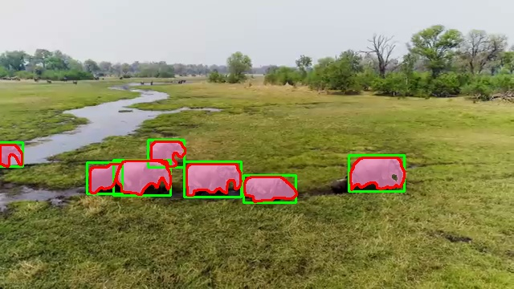
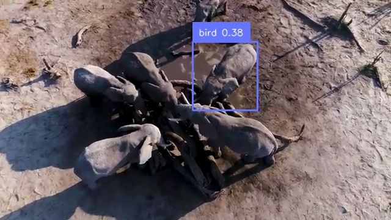
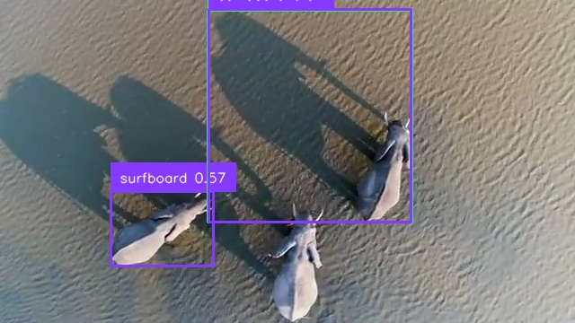
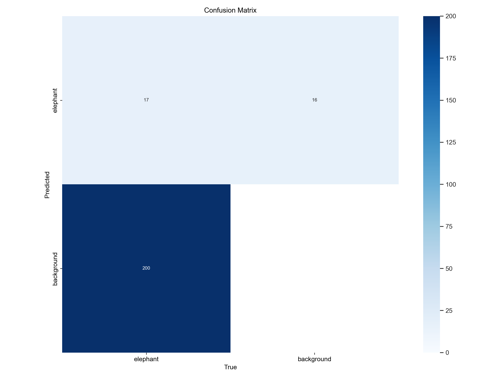
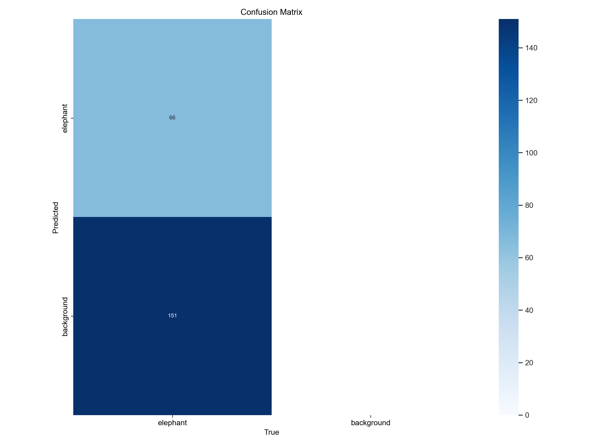
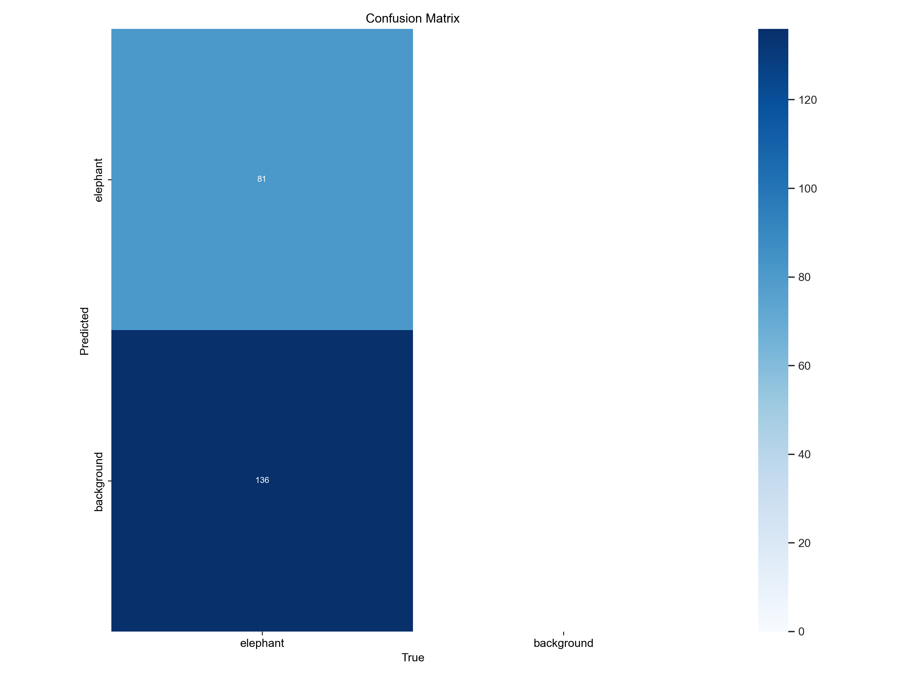

# SafaryCount

L'objectif de cette IA est de compter des éléphants dans un film. 

Le film présente des séquences avec des éléphants et des séquences sans animaux. 

Il n'y a pas d'autres animaux que des éléphants. 

Le programme aura comme sortie un compte rendu décrivant les séquences de cette manière :  

- nb de séquences avec des éléphants. 

- nb de séquences sans éléphants. 

- séquence n°1 : film ne présentant pas d'éléphant (0 détections) de l'image 10 à l'image 25. 
- séquence n°2 : film présentant 1 éléphant de l'image 10 à l'image 25. 
- séquence n°3 : film présentant 6 éléphants de l'image 56 à l'image 156. 

Le modèle doit reconnaitre cet animal dans un premier temps avant de le suivre (tracking) sur un intervalle de temps (d'images) donné. 

## présentation du repository. 

Ce repo contient :  

un dossier `pictures` qui contient les illustrations de ce README. 

un dossier `videos` qui contient les vidéos nécessaires à l'utilisation de ces modules. 

## utilisation. 

sur environnement virtuel. 

`pip install -r requirements.txt`. 

# 1 : Utilisation de Yolo. 

`python3 useModel.py --video_path videos/elephant.mp4`. 

Dans ce cas, le module télé-chargera automatiquement le modèle Yolov8s. 

ou.  

`python3 useModel.py --video_path videos/elephant.mp4 --model weights/elephant_epochs_3.pt`. 

Dans ce cas, le module utilise le nouveau modèle crée. 

La version 8 de Yolo permet la détection d'animaux de la savanne tels que des giraffes, zèbres et éléphants. Il affiche sur l'image des rectangles de détection (Regions Of Interest ou ROIs) entourant les objects détectés. Chacune des détections est nommée par un identifiant de classe 'bird' et son score de confidence. 

0 : person. 
20 : éléphant. 
34 : zebra. 

La liste des objets reconnus par Yolo se trouve dans 'self.model.names'. Il s'agit d'un dictionnaire avec l'identifiant (le numéro) de la classe en key et l'étiquette de la classe (le nom ou label) dans les valeurs. 

A chaque image, Yolo produit une détection de ce type : 5 éléphants, 3 trees, 1 laptop. 

Si on applique la version téléchargée de Yolov8s et que l'on applique sur le film, on observe :

- Yolo ne détecte pas tous les éléphants : il n'y a pas de détection autour de l'animal. 
- Yolo confond les éléphants avec d'autres animaux tels que les vaches, les chevaux et même les oiseaux. 
- Yolo confond les arbres avec des brocolis. 

Les modèles de Yolo sont évalués par une matrice de confusion (celle-ci se trouve dans le dossier train produit par l'entrainement de Yolo). 
Cette matrice compte les : 

- **True Positifs** : Yolo détecte un éléphant et il s'agit bien d'un éléphant. 
- **False Positifs** : Yolo détecte un éléphant mais ce n'en est pas un. 

Dans ces deux situations, Yolo affiche un rectangle de détection sur l'image (au moins 1 détection). 

- **False Negatifs** : Yolo ne détecte pas d'éléphant alors qu'il y en a un.
- **True Negatifs** : Yolo ne détecte pas d'éléphant et il n'y en a pas. 

Dans ces deux situations, Yolo n'affiche pas de rectangle de détection (0 détections). 

# La préparation des données d'entrainement. 

Comme la plupart des modèles d'IA, on peux ré-entrainer Yolo. Pour cela, il faut préalablement créer des données d'apprentissage. 
Yolo est un réseaux de neurones qui prend en entrée des images. 
Ces images sont classées dans 3 dossiers : `train`, `test` et `val`. 
Train et test sont les données qui serviront aux calculs du modèle (les epochs). 
Val servira à l'évaluation du modèle : les résultats du dossier `runs` fournit après entrainement (dont la matrice de confusion). 

On peux dans un premier tamps diviser le film en séquences :
séquences avec des éléphants,
séquences sans animaux.

On lit ensuite ces séquences pour en sortir les images et les détections. 
Les détections données par Yolo sont les coordonnées des 2 points (supérieur gauche et inférieur droit) du rectangle de détection. 
La donnée d'entrainement que l'on doit lui fournir présente une transformation de ce rectangle. 
Les labels que l'on doit fournir à Yolo sont des fichiers txt de ce type :

`0 0.53 0.47 0.22 0.1 = id c_x c_y w h`. 

avec. 

id l'identifiant de la classe (son numéro). 

c_x et c_y le centre du rectangle de détection. 

w et h largeur et hauteur du rectangle. 

Ces valeurs sont normalisées par rapport aux dimensions de l'image. 

On a donc ces couples :
- image avec au moins un éléphant et label txt avec le(s) roi(s) de chaque elephant. 
- image sans elephant et label txt vide. 

## Yolov8-seg. 
Yolov8 permet la segmentation d'image : il donne les contours des animaux dans les prédictions. Ces masques sont des images binaires c'est-à-dire une image noire avec un seul éléphant (prediction) en blanc. S'il y a 5 éléphants dans l'image, alors il y aura 5 masks. 

Pour entrainer le modèle avec de la segmentation d'image, il faut créer des fichiers txt contenant les coordonnées des points des contours. 

Il aura donc ce format :  
20: x0 y0 x1 y1 x2 y2 ...  
Là encore ces coordonnées doivent être normalisées. 

# 2 Creation des données : le module createData.py. 

Ce module prend en entrée 2 films : l'un contenant au moins un éléphant dans toutes les images, l'autre ne contenant aucun animal dans toutes les images. 

Ce module rempli les dossiers d'entrainement avec l'image et son label associé. Pour les images ne contenant pas d'animal, le label est présent mais vide. 

Lors de la détection des animaux pour le film qui contient des éléphants, on prévient Yolo que tout animal détecté est un éléphant. 

On prend toutes les détections d'animaux de Yolo comme étant une prédiction :

'''python3
self.dict = self.model.names. 

animals = ['bird', 'cat', 'dog', 'horse', 'sheep', 'cow', 'elephant', 'bear', 'zebra', 'giraffe']. 

animal_numbers = [key for key, value in self.dict.items() if value in animals]. 

'''

Le module rempli les dossiers avec les couples images-labels. 

Les labels du film ne présentant pas d'animaux existent mais sont vides. 

Cela permet à Yolo d'apprendre ce que **n'est pas** un éléphant. 

Les labels avec des éléphants porte l'identifiant de classe 0 car notre modèle n'est fait que pour reconnaitre des éléphants. 

Il n'aura donc qu'une seule classe. 

# 3 entreinament (deep learning) du modèle : le module createModel.py. 

Lors de l'entrainement et la création de notre modèle d'IA, Yolo va créer un dossier 'runs' qui contient tous les entrainements effectués (ils sont numérotés). 
Ces entrainement contiennent les modèles crées et leurs résultats (dont la matrice de confusion). 
L'entrainement (les epochs) prend un certain temps qui dépend du nombre d'images d'entrainement (train et test). 

Le module 'createModel.py' crée un fichier 'data.yaml' nécessaire à l'apprentissage de Yolo et un dossier `weights` qui contient les différents modèles crées pour comparatif de résultats ainsi qu'un dossier `results` qui contient les matrices de confusion de chaque modèle. 

Ce fichier contient les chemins vers les données, le nombre de classe (ici 1) et l'étiquette de la classe (éléphant). 

Après l'entrainement (le défilé des epochs), le programme stocke le nouveau modèle nommé 'elephant_nb_epochs.pt' dans le dossier `weights`. 

Les résultats (performances) du nouveau modèle sont stockés dans le dossier `results`. 

Ces résultats contiennent une série de graphiques dont la matrice de confusion. 

Avec 3 épochs, la matrice de confusion est la suivante. 

Avec 10 épochs, la matrice de confusion est la suivante. 

Pour poursuivre l'apprentissage, on peux aussi prendre le dernier modèle entrainé (celui à 10 epochs) et re-lancer un apprentissage. 

En résultat, on aura un modèle qui aura appris sur 20 epochs et qui donne la matrice de confusion suivate. 

On constate que le modèle apprend mieux au fur et à mesure des épochs. 

# 4 l'utilisation du modèle : le module useModel.py. 

Ce module prend en entrée le nouveau modèle d'IA pour l'appliquer sur le film et obtenir le compte rendu attendu. 

Le module utilisé ici est supervision afin d'utiliser ses options tels que l'affichage labelisé et le tracking, permettant de suivre chaque animal d'une séquence donnée. 

Cette fois, l'input est le fim en entier (contenant des séquences avec et sans éléphants) ainsi que le nouveau modèle crée. 

On constate déjà une nette amélioration avec une détection exacte des éléphants (ils ne sont plus confondus avec d'autres animaux) et aucune détection sur les séquences où il n'y a pas d'animaux. 

