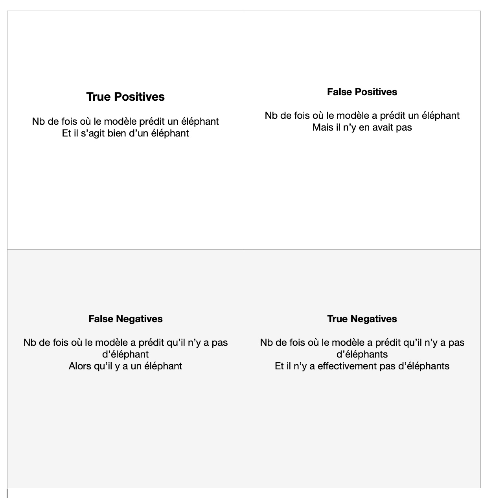

# SafaryCount

The objective of this AI is to count elephants in a movie.

This movie features sequences with elephants and sequences without animals.

There are no other animals besides elephants.

The program will output a report describing the sequences as follows:

Number of sequences with elephants.

Number of sequences without elephants.

Sequence No. 1: film with no elephants (0 detections) from frame 10 to frame 25.

Sequence No. 2: film with 1 elephant from frame 10 to frame 25.

Sequence No. 3: film with 6 elephants from frame 56 to frame 156.

The model must first recognize this animal before tracking it over a given time (frame) interval.

## This repository contains

A pictures folder contains the illustrations for this README.

A videos folder contains the videos necessary for using these modules.

## Use it. 

On virtual environment

`pip install -r requirements.txt`. 

# 1 : Using Yolo. 

`python3 useModel.py --video_path videos/elephant.mp4`. 

In this case, the module will automatically download the Yolov8s model.

ou.  

`python3 useModel.py --video_path videos/elephant.mp4 --model weights/elephant_epochs_3.pt`. 

n this case, the module uses the newly created model.

Version 8 of Yolo enables detection of savannah animals such as giraffes, zebras, and elephants. It displays bounding boxes (Regions Of Interest or ROIs) around detected objects on the image. Each detection is labeled with a class identifier 'bird' and its confidence score.

0: person.

20: elephant.

34: zebra.

The list of objects recognized by Yolo is found in self.model.names. It's a dictionary where the class identifier (number) serves as the key and the class label (name) is the corresponding value.

For each image, Yolo produces detections such as: 5 elephants, 3 trees, 1 laptop.

Applying the downloaded version of Yolov8s to the film results in:

Yolo does not detect all elephants; there are no detections around the animal.
Yolo confuses elephants with other animals such as cows, horses, and even birds.
Yolo mistakes trees for broccoli.

Yolo models are evaluated using a confusion matrix, located in the `train` folder produced during Yolo training. This matrix categorizes detections as:

- **True Positives (TP)**: Yolo detects an elephant, and it is indeed an elephant.
- **False Positives (FP)**: Yolo detects an elephant, but it is not an elephant.

In both cases, Yolo displays a detection box on the image (at least 1 detection).

- **False Negatives (FN)**: Yolo fails to detect an elephant when there is one present.
- **True Negatives (TN)**: Yolo correctly does not detect an elephant when there is none present.

In both situations, Yolo does not display a detection box (0 detections).

# Data Preparation for Training

Like most AI models, Yolo can be retrained. To do this, training data must be prepared beforehand. Yolo is a neural network that takes images as input.

These images are categorized into three folders: `train`, `test`, and `val`. `Train` and `test` contain data used for model computations (epochs). `Val` is used to evaluate the model: results from the `runs` folder provided after training (including the confusion matrix).

Initially, the film is divided into sequences:
- Sequences with elephants,
- Sequences without animals.

Next, these sequences are processed to extract images and detections. Yolo provides detections as coordinates of two points (top-left and bottom-right) of the detection rectangle.

The training data provided to Yolo includes a transformation of these rectangles. The labels required by Yolo are text files of this type:

`0 0.53 0.47 0.22 0.1 = id c_x c_y w h`. 

With:

- `id` as the class identifier (its number).
- `c_x` and `c_y` as the center of the detection rectangle.
- `w` and `h` as the width and height of the rectangle.

These values are normalized with respect to the dimensions of the image.

We thus have these pairs:
- An image with at least one elephant and a corresponding label txt file with the ROIs of each elephant.
- An image without an elephant and an empty label txt file.

## Yolov8-seg. 

Yolov8 supports image segmentation: it provides outlines of animals in its predictions. These masks are binary images, meaning a black image with a single elephant (prediction) in white. If there are 5 elephants in the image, there will be 5 masks.

To train the model with image segmentation, text files must be created containing the coordinates of the contour points. 

They will have this format:
20: x0 y0 x1 y1 x2 y2 ...

Once again, these coordinates must be normalized.

# 2 Data Creation: the createData.py module.

This module takes as input 2 movies: one containing at least one elephant in all images, the other containing no animals in any images.

The module populates the training folders with each image and its associated label. For images without any animals, the label exists but is empty.

During animal detection for the movie containing elephants, Yolo is informed that any detected animal is an elephant.

All animal detections by Yolo are considered predictions. 

'''python3
self.dict = self.model.names. 

animals = ['bird', 'cat', 'dog', 'horse', 'sheep', 'cow', 'elephant', 'bear', 'zebra', 'giraffe']. 

animal_numbers = [key for key, value in self.dict.items() if value in animals]. 

'''

The module populates the folders with image-label pairs.

Labels for the movie without animals exist but are empty.

This allows Yolo to learn what **is not** an elephant.

Labels for elephants are assigned the class ID 0 because our model is designed specifically to recognize elephants.

Therefore, it has only one class.

It's important to verify data balance before training: there should be an equal number of image-label pairs for data with elephants and data without elephants.

# 3 Training (Deep Learning) of the Model: the createModel.py module.

During training and the creation of our AI model, Yolo will create a 'runs' folder that contains all performed trainings (numbered sequentially). These trainings include the created models and their results, including the confusion matrix.

Training (epochs) takes a certain amount of time depending on the number of training images (train and test).

The `createModel.py` module creates a `data.yaml` file necessary for Yolo's learning, a `weights` folder containing the different models created for result comparison, and a `results` folder containing the confusion matrices of each model.

This file includes paths to the data, the number of classes (here 1), and the class label (elephant).

After training (epochs completion), the program stores the new model named 'elephant_nb_epochs.pt' in the `weights` folder.

The performance results of the new model are stored in the `results` folder.

These results include a series of graphs, including the confusion matrix.

As a reminder, this matrix is defined as:

Ideally, the matrix should be diagonal.

With 3 epochs, the confusion matrix looks like this:

With 10 epochs, the confusion matrix looks like this:

To continue learning, we can also take the last trained model (the one at 10 epochs) and re-run the training.

As a result, we will have a model that has learned over 20 epochs, producing the following confusion matrix:

We observe that the model learns better with more epochs, but the True Background column (right column) remains empty.

This implies that the model is not good because it fails to correctly distinguish images without elephants.

# 4 Using the Model: the useModel.py module.

This module takes as input the new AI model to apply it on the movie and obtain the expected report.

The module utilizes `supervision` to leverage its options such as labeled display and tracking, enabling the tracking of each animal in a given sequence.

This time, the input is the entire movie (containing sequences with and without elephants) along with the newly created model.

We already observe a significant improvement with accurate detection of elephants (no longer confused with other animals) and no detections in sequences where there are no animals.

The model's report is presented as follows:

total number of images: 10.

number of sequences with no elephants: [8, 9].

number of elephants detected: 8.

elephant #0: image 1 - image 9.

elephant #1: image 1 - image 9.

elephant #2: image 1 - image 9.

elephant #3: image 1 - image 9.

elephant #4: image 1 - image 9.

elephant #5: image 1 - image 9.

elephant #6: image 1 - image 9.
