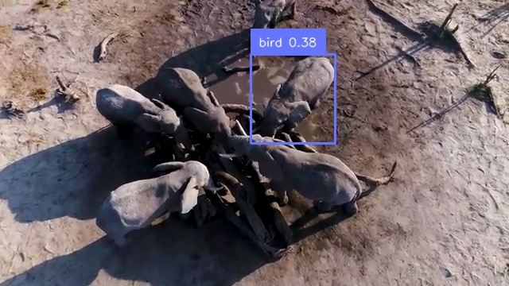
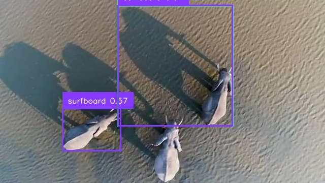

# SafaryCount

L'objectif de cette IA est de compter des éléphants dans un film. 

Le film présente des séquences avec des éléphants et des séquences sans animaux. 

Il n'y a pas d'autres animaux que des éléphants. 

Le programme aura comme sortie un compte rendu décrivant les séquences de cette manière :  

- nb de séquences avec des éléphants. 

- nb de séquences sans éléphants. 

Pour les séquences avec des éléphants :  

- séquence n°1 : 1 éléphant de l'image 10 à l'image 25. 

- séquence n°4 : 6 éléphants de l'image 56 à l'image 156. 

# 1 : Utilisation de Yolo. 

La version 8 de Yolo permet la détection d'animaux de la savanne tels que des giraffes, zèbres et éléphants. Il affiche sur l'image des rectangles de détection (Regions Of Interest ou ROIs) entourant les objects détectés. Chacune des détection est nommée par un identifiant de classe 'bird' et son score de confidence. 

0 : person. 
20 : éléphant. 
34 : zebra. 

A chaque image, Yolo produit une détection de ce type : 5 éléphants, 3 trees, 1 laptop. 

Si on applique la version téléchargée de Yolov8s et que l'on applique sur le film, on observe :

- Yolo ne détecte pas tous les éléphants : il n'y a pas de détection autour de l'animal. 
- Yolo confond les éléphants avec d'autres animaux tels que les vaches, les chevaux et même les oiseaux. 
- Yolo confond les arbres avec des brocolis. 

Les modèles de Yolo sont évalués par une matrice de confusion (celle-ci se trouve dans le dossier train produit par l'entrainement de Yolo). 
Cette matrice compte les : 

- **True Positifs** : Yolo détecte un éléphant et il s'agit bien d'un éléphant. 
- **False Positifs** : Yolo détecte un éléphant mais ce n'en est pas un. 
Dans ces deux situations, Yolo affiche un rectangle de détection sur l'image (au moins 1 détection). 

- **False Negatifs** : Yolo ne détecte pas d'éléphant alors qu'il y en a un.
- **True Negatifs** : Yolo ne détecte pas d'éléphant et il n'y en a pas. 
Dans ces deux situations, Yolo n'affiche pas de rectangle de détection (0 détections). 

# 2 Ré-entrainement de Yolo : Data prepa. 

Comme la plupart des modèles d'IA, on peux ré-entrainer Yolo. Pour cela, il faut préalablement créer des données d'apprentissage. 
Yolo est un réseaux de neurones qui prend en entrée des images. 
Ces images sont classées dans 3 dossiers : **train**, **test** et **val**. 
Train et test sont les données qui serviront aux calculs du modèle (les epochs). 
Val servira à l'évaluation du modèle : les résultats du dossier 'runs' fournit après entrainement (dont la matrice de confusion). 

On peux dans un premier tamps diviser le film en séquences :
séquences avec des éléphants,
séquences sans animaux.

On lit ensuite ces séquences pour en sortir les images et les détections. Les détections sont des fichiers txt de ce type :
20: c_x c_y w h. 
avec. 
20: l'identifiant de la classe (éléphant). 
c_x et c_y le centre du rectangle de détection. 
w et h largeur et hauteur du rectangle. 

Ces valeurs sont normalisées par rapport aux dimensions de l'image. 

On a donc ces couples :
- image avec au moins un éléphant et label txt avec le(s) roi(s) de chaque elephant. 
- image sans elephant et label txt vide. 

## Yolov8-seg. 
Yolov8 permet la segmentation d'image : il donne les contours des animaux dans les prédictions. Ces masques sont des images binaires c'est-à-dire une image noire avec un seul éléphant (prediction) en blanc. S'il y a 5 éléphants dans l'image, alors il y aura 5 masks. 

Pour entrainer le modèle avec de la segmentation d'image, il faut créer des fichiers txt contenant les coordonnées des points des contours. Il aura donc ce format ;
20: x0 y0 x1 y1 x2 y2 ...  

## Creation des données : le module createData.py. 

Ce module prend en entrée 2 films : l'un contenant au moins un éléphant dans toutes les images, l'autre ne contenant aucun animal dans toutes les images. 

Ce module rempli les dossiers d'entrainement avec l'image et son label associé. Pour les images ne contenant pas d'animal, le label est présent mais vide. 

Lors de la détection des animaux pour le film qui contient des éléphants, on prévient Yolo que tout animal détecté est un éléphant. 

On prend toutes les détections d'animaux de Yolo comme étant une prédiction :

'''python3
self.dict = self.model.names. 

animals = ['bird', 'cat', 'dog', 'horse', 'sheep', 'cow', 'elephant', 'bear', 'zebra', 'giraffe']. 

animal_numbers = [key for key, value in self.dict.items() if value in animals]. 

'''

